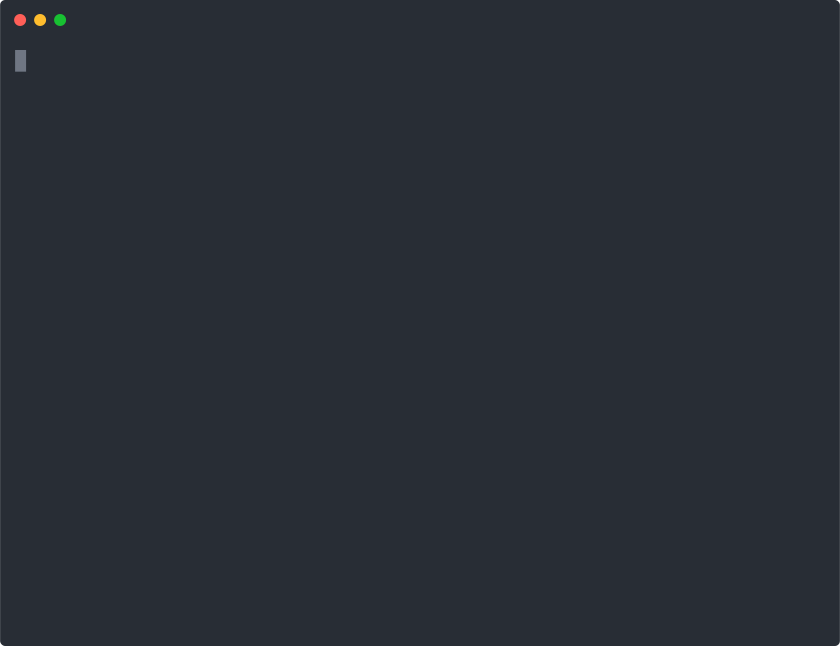
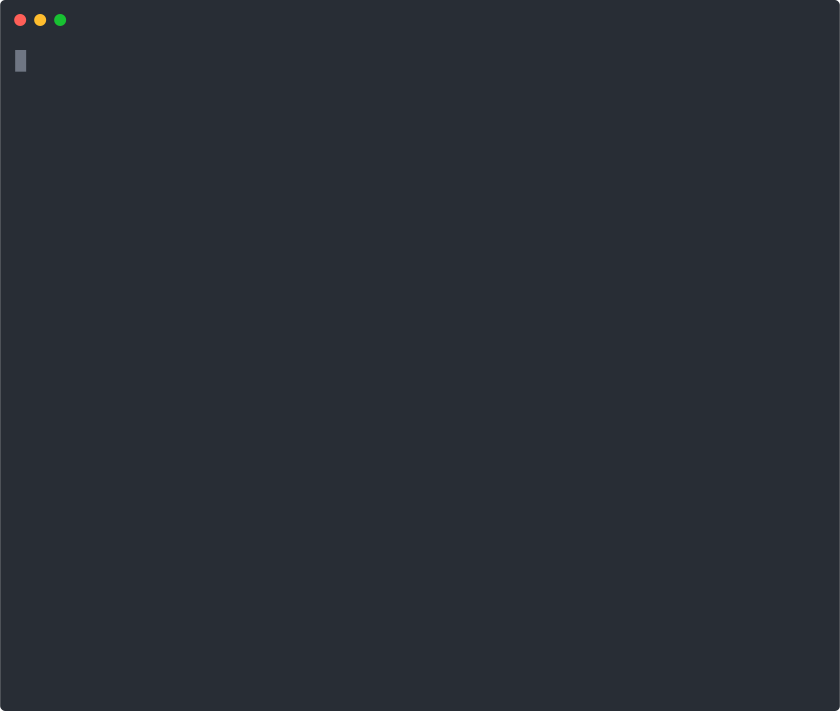

# 搭建 React 项目

## 从零开始创建 React 项目

上篇文档已经简单介绍了 react 风格的 tsx 代码，本篇文档主要讲述如何创建一个 React 项目进行工作。

创建 react 项目，本文档会介绍两种运行 react 应用的方式：

1. 我们可以使用上篇文档 demo 中所使用的 babel 来运行 react 应用。
2. 我们可以使用 Facebook 提供的 create-react-app 脚手架来创建 react 项目，然后用 cli 来运行 react 应用。

> 注：电脑上需要有 nodejs 和 npm 运行环境

### Babel 运行 React 应用

这种 Babel 运行 react 应用的方式，是我们主要用来写 demo 或者学习 react 入门使用的方式。

#### 步骤

1. 新建一个文件夹，打开命令行工具
2. 输入`npm init`命令，一路回车
3. 安装 http-server，用于启动本地服务器  
  

   

4. 安装`react`，`react-dom`  

   

5. 新建`index.html`：

   ```text
   <html>
     <head>
       <meta charset="UTF-8" />
       <title>Hello World</title>
       <!--引入react及react-dom-->
       <script src="./node_modules/react/umd/react.development.js"></script>
       <script src="./node_modules/react-dom/umd/react-dom.development.js"></script>
       <!--引入babel在线翻译器-->
       <script src="https://unpkg.com/babel-standalone@6.15.0/babel.min.js"></script>
       <!--我们自己写的jsx组件-->
       <script type="text/babel" src="./demo.jsx"></script>
     </head>
     <body>
       <div id="app"></div>
       <script type="text/babel">
         window.onload = () => {
           ReactDOM.render(<List />, document.getElementById("app"));
         };
       </script>
     </body>
   </html>
   ```

6. 新建`demo.jsx`：

   ```text
   const Todo = ({ label, del }) => {
     //无状态组件，只用于展示
     //label, del为props属性，无法被修改
     return (
       <div className="todo-item">
         {label} <button onClick={del}>删除</button>
       </div>
     );
   };
   ​
   class List extends React.Component {
     //class有状态组件
     state = {
       //声明并初始化state
       labelInput: "",
       searchInput: "",
       list: []
     };
   ​
     add = () => {
       //增加方法
       const { list, labelInput } = this.state;
       list.push({ label: labelInput });
       this.setState({ list });
     };
     del = index => {
       //删除方法
       const { list } = this.state;
       list.splice(index, 1);
       this.setState({ list });
     };
     render() {
       //渲染方法
       const { add, del } = this;
       const { list, labelInput, searchInput } = this.state;
       return (
         <div>
           <h1>Todo List</h1>
           {
             //单向数据流
           }
           <input
             type="text"
             value={labelInput}
             onChange={e => this.setState({ labelInput: e.target.value })}
           />
           <button onClick={add}>增加</button>
           <input
             type="text"
             value={searchInput}
             onChange={e => this.setState({ searchInput: e.target.value })}
             placeholder="输入查询"
           />
           {list
             .filter(({ label }) => label.indexOf(searchInput) !== -1)
             .map((v, index) => (
               <Todo key={index} del={() => del(index)} {...v} />
             ))}
         </div>
       );
     }
   }
   ```

7. 命令行输入`http-server`，启动服务器
8. 浏览器打开[http://localhost:8080/](http://localhost:8080/)，查看我们的react应用

### create-react-app 搭建 React 应用

这个脚手架是用 webpack 来加载 react 应用的，通常我们在开发项目中主要会使用脚手架来搭建并运行部署 react 项目。

#### 步骤

```text
yarn create react-app my-app --typescript
​
cd my-app
​
yarn start
```

打开浏览器访问[http://localhost:3000/](http://localhost:3000/)，就可以看到，我们的react应用已经开始运行了。

