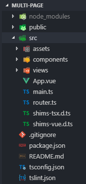
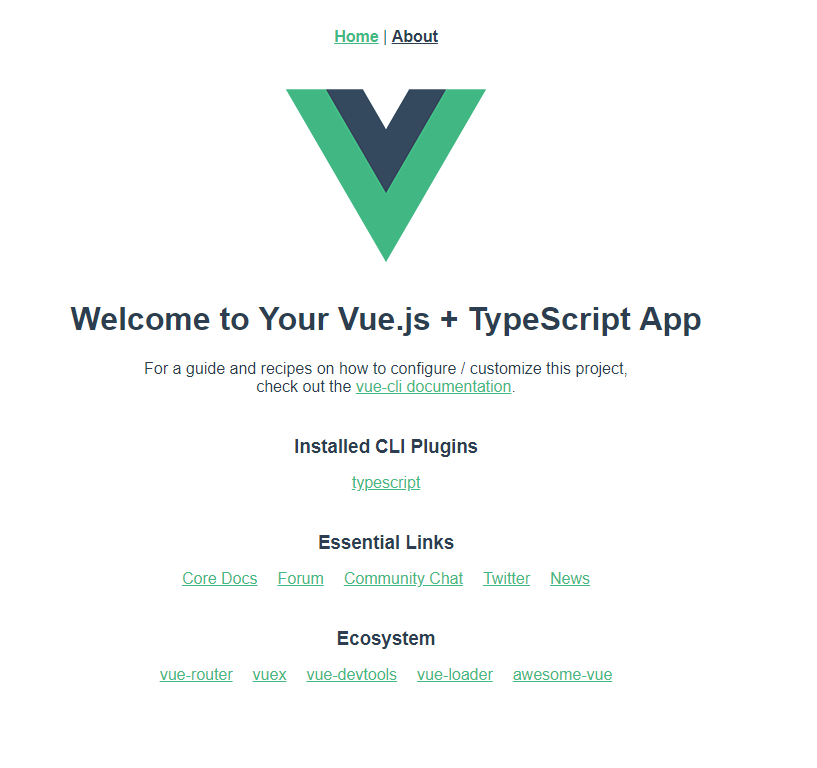
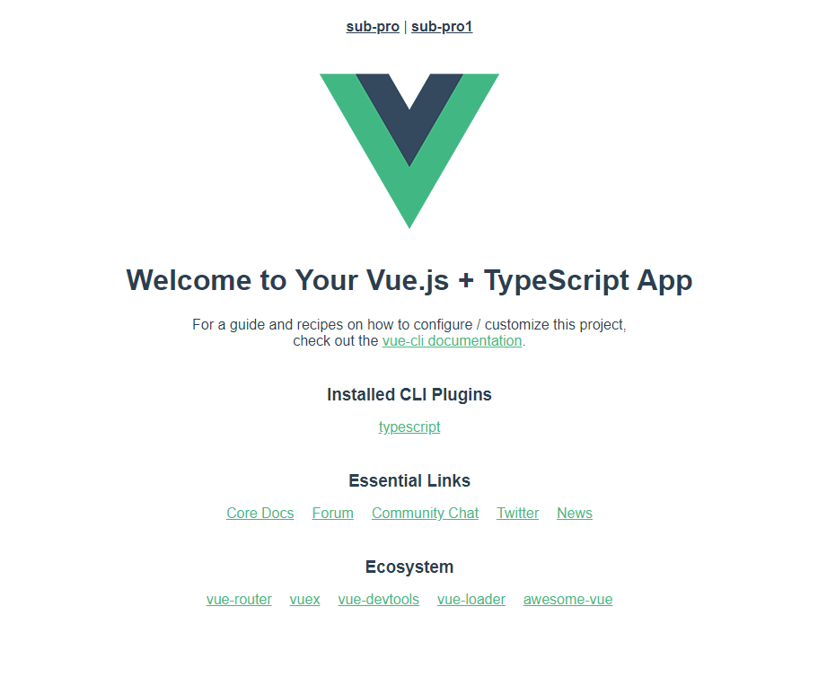

# VUE多入口多项目项目架构（multi-page）（例如：OA系统，CRM系统）

## 多入口多页面项目？？？

众所周知，一般的webpack项目都是单页面项目，我们也是可以配置webpack为多入口项目的。

## 为什么使用多入口架构？

一般情况下，我们使用vue cli3来打包单页面应用程序，只需要使用默认配置的一个入口就可以了。但是，如果一个项目很大，有很多小的分项目，这种情况就比较适合多页面程序了，也就是`webpack`多入口。

## 思考：多入口解决哪些痛点？

例如我司的OA系统，比较复杂，包含CRM，PMS，HR管理，财务等多个子系统，如果全部放在一个vue项目中去做的话，那么就出现了一些问题：

* 无法进行全局的掌控；
* 开发一个子系统时，不需要启动另外一个系统；
* 热部署一个子系统时需要编译所有系统等；

这时，使用多入口多页面架构就能避免以上的问题。

## 怎么配置vue多入口项目？

首先，我们先创建一个vue项目，这个请参考cli3官网的[教程](https://cli.vuejs.org/zh/guide/creating-a-project.html#vue-create)。

duang~我们的项目就创建好了，新建项目的目录结构应该像下图这个样子：



我们先创建两个子项目，在`src`目录下新建文件夹`sub-pro`和`sub-pro1`，然后在子项目下分别新建`App.vue`和`main.ts`:

```typescript
// sub-pro/App.vue

<template>
  <div id="app">
    sub-pro
  </div>
</template>

```

```typescript
// sub-pro/main.ts
import Vue from 'vue'
import App from './App.vue'

new Vue({
  render: h => h(App),
}).$mount('#app')

```


```typescript
// sub-pro1/App.vue

<template>
  <div id="app">
    sub-pro1
  </div>
</template>

```

```typescript
// sub-pro1/main.ts
import Vue from 'vue'
import App from './App.vue'

new Vue({
  render: h => h(App),
}).$mount('#app')

```

这样，我们的两个子项目就已经配置好了，接下来配置vue.config.js（在项目根目录下）文件：

```javascript
module.exports = {
  pages: {
    "index":{
      entry: "src/main.ts",
    },
    "sub-pro":{
      entry: "src/sub-pro/main.ts",
    },
    "sub-pro1":{
      entry: "src/sub-pro1/main.ts",
    }
  }
}
```


这里我们配置了三个入口，分别是`src/main.ts`、`src/sub-pro/main.ts`、`src/sub-pro1/main.ts` 第一个入口是我们的主入口，当我们项目启动后会进入这个入口，剩下的两个就是我们的子项目的入口。


这样，我们就配置完啦，可以启动了。命令行运行：

```bash
yarn run serve
```

熟悉的vue初始化界面：



我们的子项目在哪里呢？

现在我们来修改src/App.vue:

```markup
<!--src/App.vue-->
<template>
  <div id="app">
    <div id="nav">
      <a href="/sub-pro" target="_self">sub-pro</a> |
      <a href="/sub-pro1" target="_self">sub-pro1</a>
    </div>
    <router-view/>
  </div>
</template>

```

保存，刷新浏览器就可以看到home和about的超链接被我们改成了sub-pro和sub-pro1的超链接啦



点击超链接，就可以访问我们的sub-pro和sub-pro1子项目了。

## 问题来了，假设我们只开发sub-pro子项目，怎么只启动这个项目呢？

这个时候，我们就需要一个命令行工具来帮我们实现了[inquirer](https://www.npmjs.com/package/inquirer)，这个命令行库具体可以看官方文档。

具体的思路就是，使用[inquire](https://www.npmjs.com/package/inquirer)来询问开发者启动哪些项目，然后保存这个配置，然后使用vue.config.js来读取配置项启动选择的项目。

我们需要一个配置文件来管理我们的多入口启动项，我们在根目录下新建`pages.yml`：

```yaml
projects:
  index:
    entry: 'src/main.ts'
  sub-pro:
    entry: 'src/sub-pro/main.ts'
  sub-pro1:
    entry: 'src/sub-pro1/main.ts'
```

接下来，我们需要管理我们的多入口启动项，我们在项目根目录下新建`pages.js`：

```javascript
'use strict'
const inquirer = require('inquirer')
const yaml = require('js-yaml') // 一个解析yaml的库
const fs = require('fs')
const path = require('path')
const historyFilePath = path.join(__dirname, 'pages.json')
const pages = yaml.safeLoad(
  fs.readFileSync(path.join(__dirname, './pages.yml'), 'utf8')
)
const { projects } = pages

const hiddenChoices = ['index']

const projectsList = Object.keys(projects)
  .filter(projectName => hiddenChoices.indexOf(projectName) === -1)
  .map(projectName => ({
    name: projectName
  }))

inquirer
.prompt([
  {
    type: 'confirm',
    name: 'use_prev',
    message: '使用上次的配置?',
    default: true,
    when() {
      return fs.existsSync(historyFilePath)
    },
  },
  {
    type: 'checkbox',
    message: '选择项目',
    name: 'projects',
    choices: projectsList,
    when(answers) {
      return !fs.existsSync(historyFilePath) || !answers.use_prev
    },
    validate(answer) {
      if (answer.length < 1) {
        return '你必须至少选择一个项目.'
      }
      return true
    },
  },
])
.then(answers => {
  if (!answers.use_prev || !fs.existsSync(historyFilePath)) {
    let collections = {}
    collections.default = projects
    collections.projects = {}
    answers.projects.forEach(projectName => {
      collections.projects[projectName] = projects[projectName]
    })

    const data = JSON.stringify(collections, null, '  ')
    fs.writeFileSync(historyFilePath, data)
  }
  const projectList = Object.keys(require('./pages.json').projects)
  console.log(`使用项目: \x1b[32m${projectList.join(', ')}\x1b[0m`)
})

```

这里就将开发者选择的项目保存在了pages.json中了，接下来还要修改vue.config.js中的pages的配置：

```javascript
const isProduction = process.env.NODE_ENV === 'production'

let pages

const pagesConfigs = require('./pages.json')

if (isProduction) {
  pages = pagesConfigs.default
} else {
  pages = pagesConfigs.projects
}

module.exports = {
  pages
}

```

这样，我们就可以做到单独启动`sub-pro`这一个子项目啦。

## 问题来了，怎么只部署一个子项目？

这里我的思路是通过规范git commit message，利用commit message来确定打包部署某一个或某几个子项目，具体还在思索中，所以步骤就没有啦。

（未完待续。。。\)

